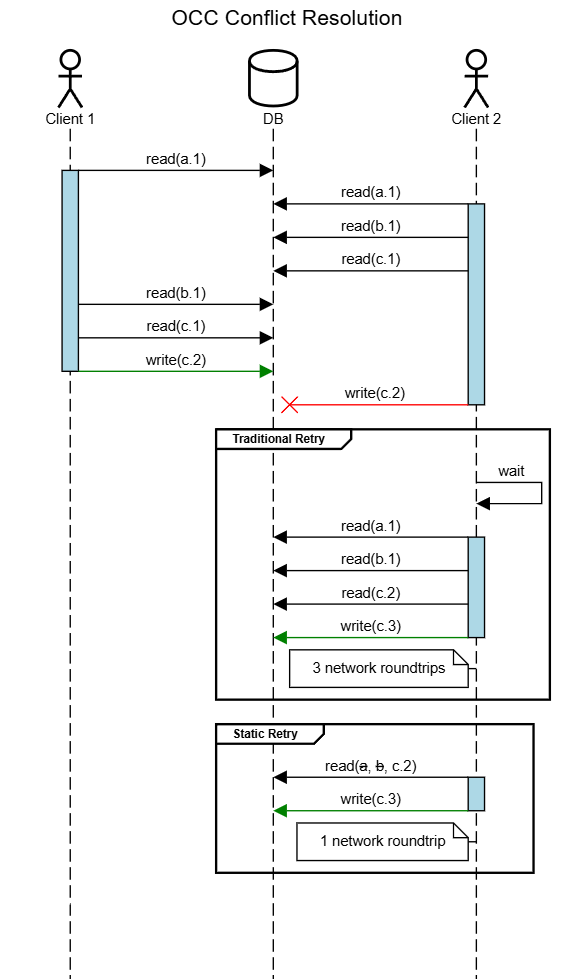

# Static Optimistic Concurrency Control for Distributed Transaction Processing Systems

This repository contains a description, proof of concept and simulation test suite for a modern refinement of
**Optimistic Concurrency Control** (OCC) [^1] designed to optimize throughput in high contention OCC workloads.

## Overview

In traditional OCC, a transaction is executed and submitted for commit with an assumption of isolation; that the process
executing the transaction (the "client") is the only process operating on the set of records required to execute the
transaction (the "read set") at a chosen isolation level for the duration of the transaction. At commit time, the
database validates whether any records in the read set were modified by another process during the transaction. If the
read set is unmodified, then the transaction commits successfully because the assumption was correct. But if any record
in the read set has been modified since it was read, the commit must fail in order to preserve consistency.

After a failed commit, the client typically sleeps for some exponential backoff interval and then retries the
transaction. While this retry strategy is the simplest and most common, it is not the only one. Other retry strategies
include **Hybrid Concurrency Control** [^2] where the client eschews the optimistic approach and switches to a
pessimistic concurrency control strategy on retry (ie. interactively acquiring an exclusive lock on every record in the
read set).

**Static Optimistic Concurrency Control** is an OCC retry strategy where the client caches the read set during the
first execution, updates only the stale values upon failure and then immediately retries the transaction with the
optimistic assumption that the read set will not change across executions. This allows all stale keys in the write-back
cache to be updated to their latest version simultaneously, optimistically assuming that the transaction will adhere to
a *static* data access scheme [^3].

If no new keys are accessed on retry then all reads can be served from the client's cache meaning that the number of
network round trips between the client and the database during the course of a transaction on retry is reduced from
`O(n)` to `O(1)`. In cases where aggregate network round trip latency during *dynamic* data access transactions is
a primary limiting factor in systemic transaction throughput, a system that can successfully reduce the number of
network round trips for optimistic concurrency transaction retries to its theoretical minimum of `1` (a key property of
the *static* data access scheme) may see a significant improvement in latency and throughput for high contention
workloads.

This strategy may reduce total system tail latencies since retries can be executed immediately without the need for
exponential backoff on conflict. It may even produce noticeable effects on total database network traffic since only
modified records need to be refreshed on each retry rather than re-fetching the entire read set.

## Sequence Diagram



Eliminating unnecessary network roundtrips on static retry reduces opportunity for conflict to its theoretical minimum.

## Example

Postgres schema for basic OCC write protection at the `Read Committed` isolation level.

```sql
CREATE TABLE kvstore (
  "key" VARCHAR(255) PRIMARY KEY,
  "version" INTEGER NOT NULL,
  "data" JSON NOT NULL
);

CREATE OR REPLACE FUNCTION occ_write_check()
  RETURNS TRIGGER AS $$
  BEGIN
    IF (NEW.version != OLD.version) THEN
      RAISE EXCEPTION 'VERSION_CONFLICT' USING ERRCODE='OC000';
    ELSE
      NEW.version := NEW.version + 1;
    END IF;
    RETURN NEW;
  END;
$$ LANGUAGE plpgsql;

CREATE OR REPLACE TRIGGER tg_occ_write_check BEFORE UPDATE ON kvstore
  FOR EACH ROW EXECUTE PROCEDURE occ_write_check();
```

Usage

```sql
INSERT INTO kvstore ("key", "version", "data") VALUES 
  ('a', 1, '{"foo": 1}'),
  ('b', 1, '{"bar": 1}'),
  ('c', 1, '{"baz": 1}');
-- INSERT 0 1

UPDATE kvstore SET "version" = 1, "data" = '{"baz": 2}' WHERE "key" = 'c';
-- UPDATE 1

UPDATE kvstore SET "version" = 1, "data" = '{"baz": 3}' WHERE "key" = 'c';
-- ERROR: VERSION_CONFLICT
```

Read set refresh example from the sequence diagram

```sql
SELECT * FROM kvstore WHERE
  ("key" = 'a' AND "version" > 1) OR
  ("key" = 'b' AND "version" > 1) OR
  ("key" = 'c' AND "version" > 1);
--  key | version |    data
-- -----+---------+------------
--  c   |       2 | {"baz": 2}
-- (1 row)
```

## Simulation Design

An example implementation written in Go will exercise this OCC schema to compare the two different retry strategies
(traditional / static).

### Tunable Dimensions

* DB Roundtrip Latency (default 1ms)
* Key Space Size (default 100)
* Read Set Size Min (default 1)
* Read Set Size Max (default 10)
* Read Set Size Distribution (default zipfian) (options: linear, static)
* Write Percent (default 10)
* Data Size Min (default 100b)
* Data Size Max (default 100kb)
* Data Size Distribution (default zipfian) (options: linear, static)
* Isolation Level (default ReadCommitted) (options: Snapshot)
* Transaction Rate (default 1000/s)
* Transaction Batch Interval (default 0 (batching disabled)) (in ms to simulate hammering for worst case scenario)
* Inner Retries (default 2)
* Outer Retries (default 2)

### Metrics

* Conflict Rate
* Average Retries
* Retry Count Burndown
* Latency Quantiles
* Active Transaction Count

## Results

TBD

## Prospective Evaluation

Measuring the potential impact of Static Optimistic Concurrency Control prior to implementation and deployment for a
given set of workloads should be possible through additional instrumentation.

* What percentage of retries in your system have read sets identical to that of the first attempt? (high?)
* What is the median number of values in the read set that actually differs from one attempt to the next? (1?)
* Is there a positive correlation between read set size and retry count? (yes?)

Collecting and analyzing these metrics may provide a low risk way to help frame this strategy within the context of your
domain by estimating the potential cost of *not* implementing it.

[^1]: [On Optimistic Methods for Concurrency Control](https://dl.acm.org/doi/10.1145/319566.319567) (1981)
[^2]: [Analysis of Hybrid Concurrency Control Schemes for a High Data Contention Environment](https://dl.acm.org/doi/abs/10.1109/32.121754) (1992)
[^3]: [Analysis of Some Optimistic Concurrency Control Schemes Based on Certification](https://dl.acm.org/doi/10.1145/317795.317824) (1985)
